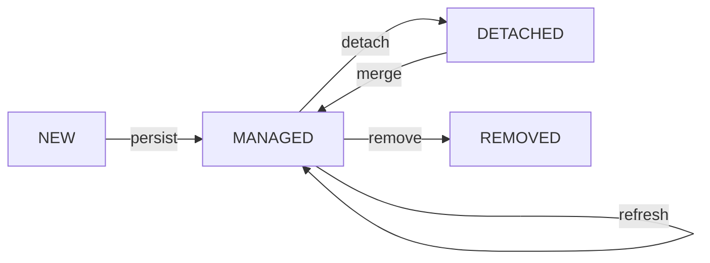

# JPA et Hibernate 
[](https://opensource.org/licenses/Apache-2.0)
[](http://makeapullrequest.com)

- Notes sur l'utilisation de l'API JPA et Hibernate des vidéos de cours-en-ligne de Monsieur Paumard.
[Lien de la playlist](https://www.youtube.com/playlist?list=PLzzeuFUy_CnhVfJIKyc3okTiiCc0anutx)


#Table des Matières

1. [Premiers pas](#Premiers pas)
2. [Annontations JPA](#Annotation JPA)
3. [Fichier de configuration "persistence.xml"](#Ficher de configuration)
4. [Cycle de vie](#Cycle de vie)
5. [les clés primaires composites](#les clés primaires composites)
6. [Cardinalités](#Cardinalités)
   1. [One to One](#One To One)
   2. [Many to One](#Many to One)
   3. [One to Many](#One to Many)
   4. [Many to Many](#Many to Many)
7. 


# 👣 Premiers pas

Le présent projet est composé des mécanismes de bases afin de tester rapidement `Hibernate` & `JPA`


 1️⃣ Ajouter la dépendance de [hibernate](https://mvnrepository.com/artifact/org.hibernate/hibernate-core)  dans le pom.xml.

 2️⃣ Créer une class java bean.

3️⃣ Annoter cette classe.

4️⃣ Créer le fichier de configuration  

5️⃣ Créer un Singleton de l'EntityManagerFactory. 

6️⃣ faire les CRUD.


## Annotations JPA

| Annotations     | interaction       |Documentation|
|-----------------|-------------------|-------------|
| @Entity         | la class          |[Documentation](https://docs.oracle.com/javaee/7/api/javax/persistence/Entity.html)|
| @Table          | la class          |[Documentation](https://docs.oracle.com/javaee/7/api/javax/persistence/Table.html)|
| @Id             | attribut de class |[Documentation](https://docs.oracle.com/javaee/7/api/javax/persistence/Id.html)|
| @GeneratedValue | attribut de class |[Documentation](https://docs.oracle.com/javaee/7/api/javax/persistence/GeneratedValue.html)|
| @Column         | attribut de class |[Documentation](https://docs.oracle.com/javaee/7/api/javax/persistence/Column.html)|
| @OntToOne       | attribut de class |[Documentation](https://docs.oracle.com/javaee/7/api/javax/persistence/OneToOne.html)|
| @OntToMany      | attribut de class |[Documentation](https://docs.oracle.com/javaee/7/api/javax/persistence/OneToMany.html)|
| @ManyToOne      | attribut de class |[Documentation](https://docs.oracle.com/javaee/7/api/javax/persistence/ManyToOne.html)|
| @OrderBy        | attribut de class |[Documentation](https://docs.oracle.com/javaee/7/api/javax/persistence/OrderBy.html)|
## ⚙ Ficher de configuration


⚠️ Le fichier de configuration doit ce trouver dans le dossier "**META-INF**" qui doit être placé dans le dossier "**ressources**".


## 🔁 Cycle de vie 



- a la création d'un bean il prend l'état **NEW**

`User user = new User(...);`

- Dans le context d'une transaction il prend l'état  **MANAGED**

`entityManager.persist(user);` ou `entityManager.merge(user);` ou `entityManager.refresh(user);`

- Dans le context d'un remove il prend l'état **REMOVED**

`entityManager.remove(user);`

- Dans le context d'un detach il prend l'état **DETACHED**

`entityManager.detach(user);`


## 🔑 les clés primaires composites

Lorsqu'une entité a une clé primaire composite cela veut dire qu'elle possède plusieurs champs.

`````java
import javax.persistence.*;

@IdClass(PrimaryKey.class)
@Entity
public class User {
  @Id
  private int pid;
  @Id
  private int uid;

  /**
   * Autre façon
   */

  @EmbeddedId
  private PrimaryKey id;
}

@Embeddable
class PrimaryKey {
  int pid;
  int uid;
}
`````
# Cardinalités 
### One to One

il faut utiliser l'annotation @OneToOne ainsi que les parametres suivants :
- `mappedBy` et le nom de l'attribut dans l'autre class.
- `cascade` avec la constante `CascadeType.PERSIST` pour pouvoir persister seulement l'objet `Commune` et non pas les deux objets.
- `fetch` avec les constantes suivantes : 
  - `FetchType.EAGER`qui permet de faire une requête avec une jointure pour récupérer les deux Objets (dans l'exemple un objet `Commune` et `Maire`)
  - `FetchType.Lazy` qui permet a JPA de détecter la création d'un objet `Maire` et lancera un `SELECT` pour cet objet uniquement si l'objet `Commune` est dans l'état `MANAGED`

Il faut trouver la meilleure solution suivant nos besoins.

⚠️la relation bidirectionnelle doit être géré manuellement côté java. 

`````java
import javax.persistence.*;

public class Commune {

    private String name;
    @OneToOne(cascade = CascadeType.PERSIST, fetch = FetchType.EAGER)
    private Maire maire;

    public Maire getMaire() {
        return maire;
    }
}

public class Maire {

    private String name;
    @OneToOne(mappedBy = "maire")
    private Commune commune;

}

public class Main {

    public static void main(String[] args) {
        EntityManagerFactory entityManagerFactory = Persistence.createEntityManagerFactory("Default");
        EntityManager entityManager = entityManagerFactory.createEntityManager();

        Commune c = entityManager.find(Commune.class, 1);
        Mairie m = c.getMaire();

    }
}

`````
Lorsque le lien entre deux classes est très fort comme `Adresse` d'un `User` n'as plus lieu d'être si celui-ci est supprimé. 

pour ce faire il faut modifier l'annotation `@Entity` par `@Embeddable` pour les "Embarqué" avec l'entité.

````java
import javax.persistence.Embeddable;
import javax.persistence.Embedded;
import javax.persistence.Entity;

@Entity
public class User {

    private String name;
    @Embedded
    Address address;
}

@Embeddable
public class Address {

    private String address;

}
````


### Many to One


fonctionne de la même façon que les OneToOne avec les mêmes méthodes


`````java
import javax.persistence.*;
import java.util.List;

public class Commune {

    private String name;
    @ManyToOne
    private Departement departement;


}

public class Departement {

    private String name;
    @OneToMany(mappedBy = "departement")
    private List<Commune> communes;
}

`````

### One to Many

Le choix fait par JPA est de créer une Table d'association entre Departement et Commune qui prend les Ids des deux Tables.


`````java
import javax.persistence.*;
import java.util.List;

public class Commune {

    private String name;


}

public class Departement {

    private String name;
    @OneToMany(mappedBy = "departement")
    private List<Commune> communes;
}

`````
JPA génére : 

`````postgres-sql

CREATE table Departement_Commune(
idDepartement int , 
idCommune int,
constraint PK_Departement_Commune primary key (idDepartement, idCommune)
)

`````

⚠️ il faut modifier les GETTERS pour éviter de modifier la BDD en utiliser une stratégie de `COPIE DEFENSIVE`.


`````java
import javax.persistence.OneToMany;
import java.util.ArrayList;

public class Departement {

  @OneToMany(mappedBy = "...")
  List<Commune> communes;

  public List<Commune> getCommunes() {
    return new ArrayList<>(this.communes);
  }
}
`````

### Many to Many

La relation Many to Many a le même comprotement que le Many to One & le One To Many.
`````java

import javax.persistence.ManyToMany;
import java.util.List;

public class Musicien {

  @ManyToMany(cascade = "...", fetch = "...")
  List<Instrument> instruments;
}

public class Instrument {

    @ManyToMany(mappedBy = "instruments")
  List<Musicien> musiciens;

}

`````

## API Collection

#### One To Many


